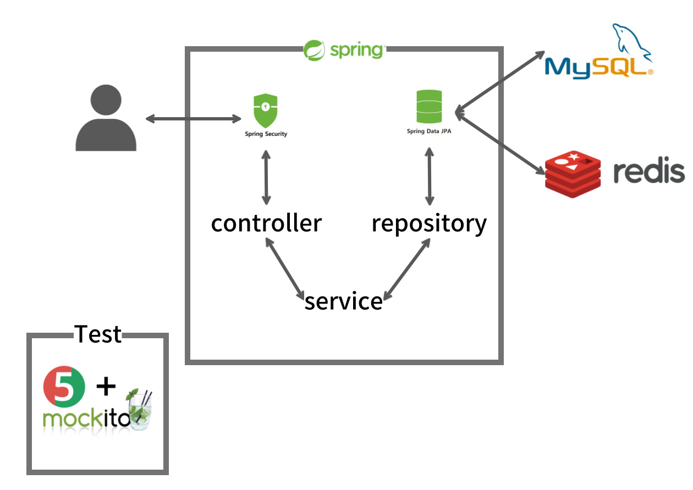
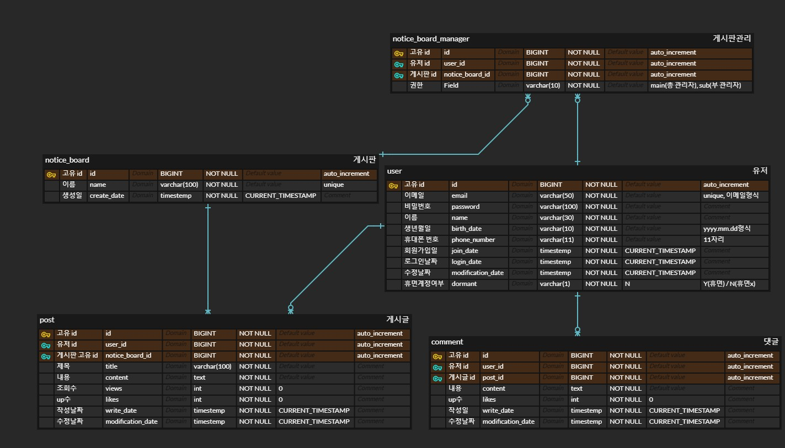

# 게시판 만들기

간단히 사용자끼리 소통 및 관리할 수 있는 게시판입니다.

# Structure

    

# ERD

    

# Skill Stack

- ### Languages

  

- ### Framework

  

- ### Security

  

- ### DB

  
  

- ### Test

  
  

- ### Other
  

# Main Function

- ### 회원가입
  - 사용자는 회원가입을 할 수 있다.
  - 이메일은 중복불가 + 'A'@'B' 형식으로 저장, 비밀번호는 암호화되어 저장
  - 이름, 생년월일(yyyy.mm.dd), 휴대폰번호(11자리)로 저장한다.
  - 회원가입일(지금시간), 로그인날짜(지금시간), 정보수정날짜(지금시간), 휴면계정(N)은 기본값으로 저장한다.
- ### 로그인
  - 저장된 이메일과 비밀번호로 로그인을 할 수 있다.
  - 로그인 날짜를 지금 시간으로 갱신해준다.
- ### 게시판 생성
  - 로그인한 유저는 게시판을 만들 수 있다.
  - 게시판 이름은 중복될 수 없다.
  - 생성일(지금시간)은 기본값으로 저장한다.
- ### 게시글 작성
  - 로그인한 유저만 글 작성이 가능하다.
  - 게시자는 제목과 내용을 작성할 수 있다.
- ### 게시글 수정
  - 작성자만 수정이 가능하다.
  - 수정 시 수정날짜가 현재 시간으로 변경된다.
- ### 게시글 삭제
  - 작성자만 삭제가 가능하다.
- ### 게시글 목록 조회
  - 로그인 여부에 상관없이 모든 사용자가 목록조회가 가능하다.
  - 10개씩 페이징되서 목록이 출력된다.
  - 정렬은 작성일순으로 정렬, 댓글 많은 순 / 적은 순으로도 정렬가능하다.
  - 응답 값으로는 게시글의 전체적인 정보이 출력된다.
- ### 특정 게시글 조회
  - 로그인하지 않은 사용자를 포함한 모든 사용자는 게시글을 조회할 수 있다.
  - 게시글의 모든 정보가 조회된다.
- ### 댓글 목록 조회
  - 특정 게시글 조회 시 댓글 목록도 함께 조회가 된다.
  - 로그인 여부에 상관없이 모든 사용자가 댓글조회가 가능하다.
  - 정렬은 최신순으로 정렬, paging처리를 한다.
- ### 게시글 검색
  - 로그인 여부에 상관없이 모든 사용자가 검색이 가능하다.
  - 검색은 제목, 내용, 게시자로 검색이 가능하다.

# Features to add

- ### 관리자 설정
  - 게시판 제작 시 제작한 유저가 자동적으로 총 관리자가 된다.
  - 총관리자는 부관리자를 설정 및 삭제할 수 있다.
  - 총관리자는 부관리자에게 권한을 넘기고 부관리자로 권한을 변경할 수 있다.
- ### 게시글 작성 (추가)
  - 임시저장을 통해 게시하지 않고 내용 저장가능하다.
- ### 게시글 수정
  - 관리자는 해당 게시판에 있는 모든 글을 수정할 수 있다.
- ### 게시글 추천 기능
  - 로그인한 사용자만 게시글을 추천할 수 있다.
  - 추천은 하루에 한 번만 가능하다.
- ### 댓글 추천 기능
  - 로그인한 사용자만 댓글을 추천할 수 있다.
  - 추천은 하루에 한 번만 가능하다
- ### 게시글 조회 (추가)
  - 조회수가 1 증가한다.  
